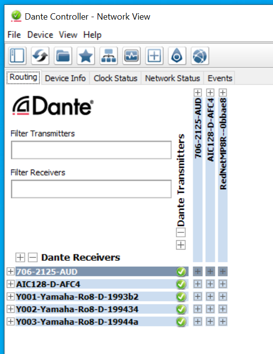
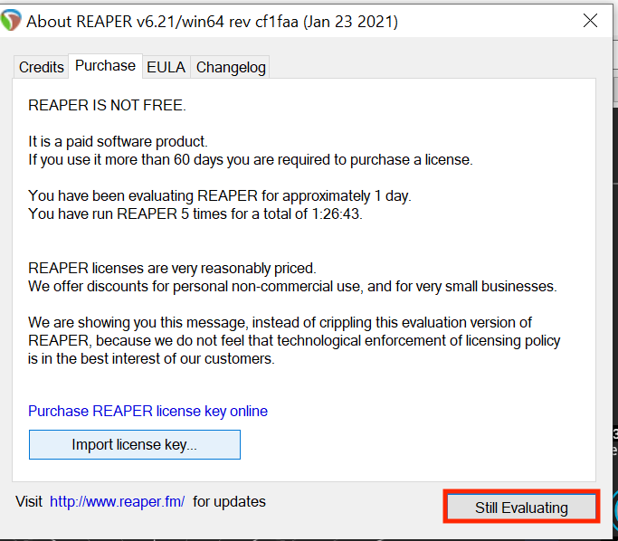
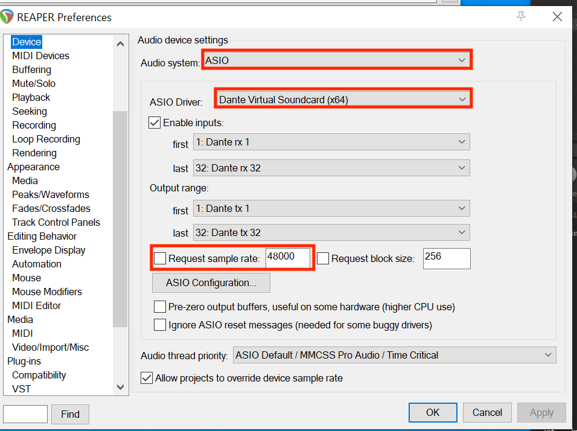
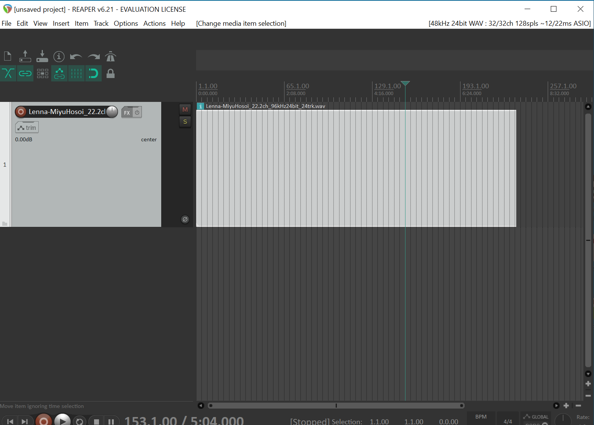
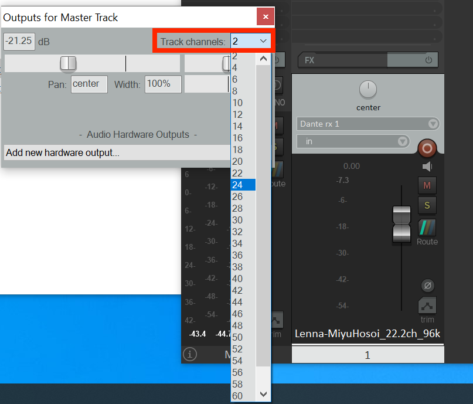
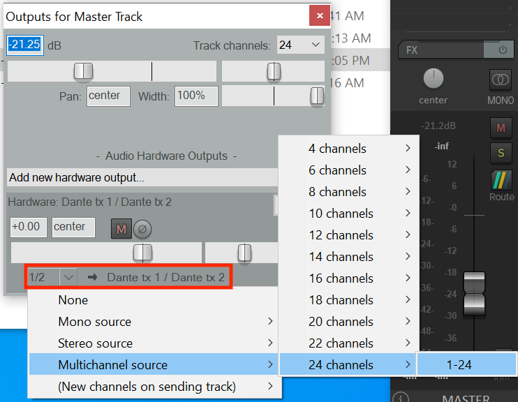
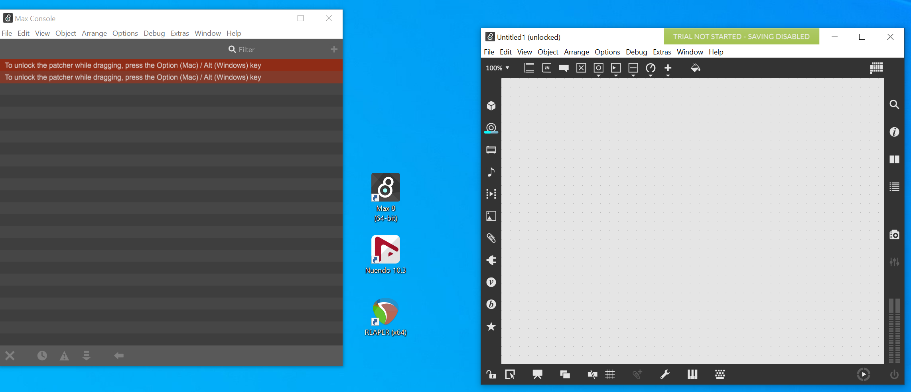
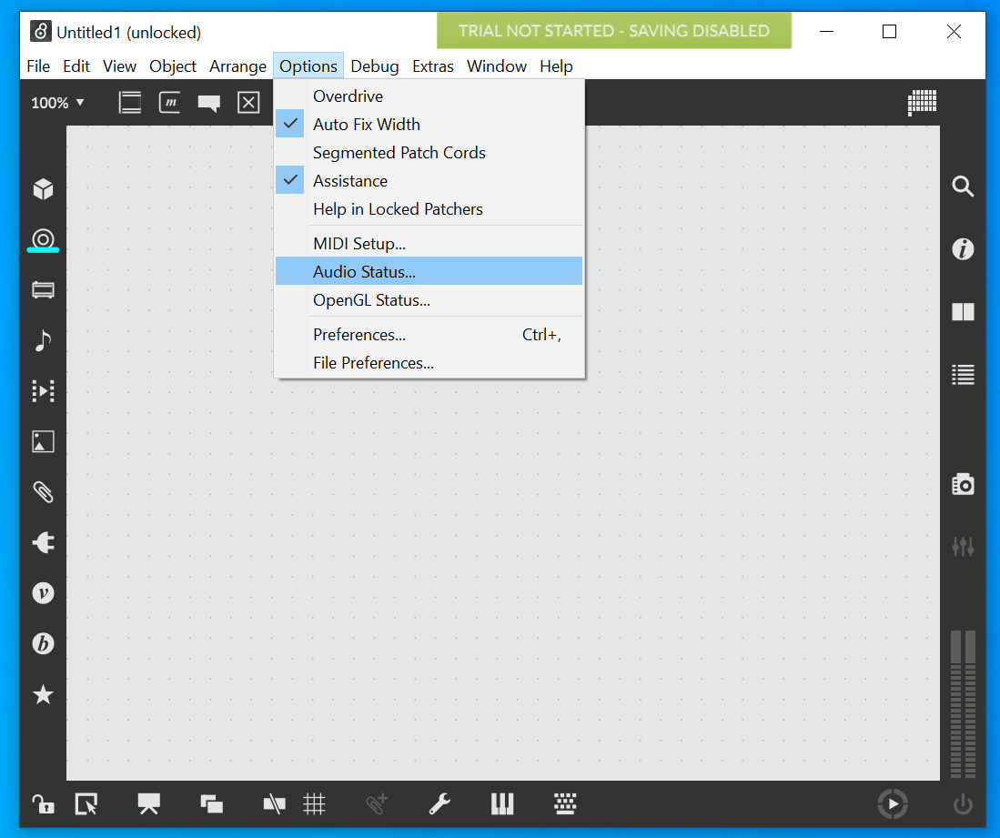
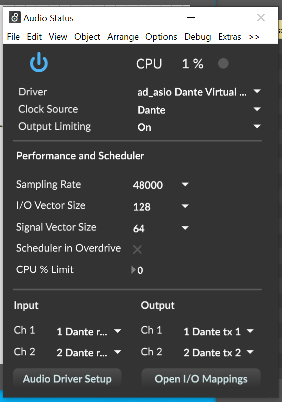

# Audio Lab Tutorial
## First of all
1. click the 'Immersive Display Pro' app to set the projector setting correctly.

2. Launch 'Dante Controller' and make sure all status icons are green.

---

## Reaper
1. Open 'Reaper' and wait 5sec until the 'Still Evaluating' button is active.

2. Open the Audio Device settings window. 

    Options > Preferences > Device

3. Make sure the audio settings are the same as below.

    Audio system: ASIO

    ASIO Driver: Dante Virtual Soundcard (x64)

    Request sample rate: 48000

    (if you want to use another sample rate, please contact 3D audio class's TA [Rai SATO (rs1641@rit.edu)])

4. drag and drop the sound source that you want to listen to onto the main window. or select the sound file from 'Media file' under the 'Insert' tab on the main menu.

5. Change MASTER track channel setting.
   Click the 'Route' button on the Master track under the Mixer window. Then the 'Outputs for Master Track' window shows up.

6. click Track channels and change the number with into the number that the sound file's channels are.

7. Change hardware channel number. Click on the area circled in red and change the channel number into the number you set 6.

8. Then, you can listen to the sound!

---

## Max 8
1. Launch 'Max' and open a new window.

2. Open 'Audio Status' window.
   Click Options > Audio Status

3. Change Audio Setting as below
    Driver: ad_asio Dante Virtual Soundcard (x64)

    Sampling Rate: 48000
    
    Don't change the sampling rate unless there is some particular reason. 

4. play some sounds using 'dac~'

---

## Nuendo
1. Open 'Nuendo'.
2. After launching Nuendo, select 'Dante Virtual Soundcard (x64)' on the Audio Driver Setup Window.

3. click on the 'Create Empty' button.

4. Open the 'Audio Connection' window from studio tab > audio connection, then click on the 'Output' tab. 

5. Check all device ports are started from 'Dante tx ~'. (btw, You can create any bus settings you want here.)

6. drag and drop the sound source, then play the sound. Make sure the output-bus setting in the middle of the Inspector panel is correct. 

